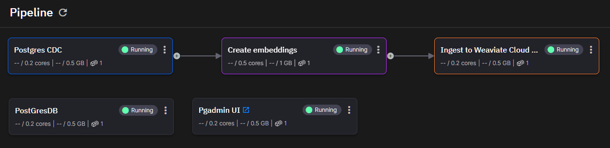

# Change Data Capture (CDC) Tutorial: PostgreSQL to Weaviate via Kafka

## Overview
This repository accompanies the blog article "Change Data Capture (CDC) from PostgreSQL into Weaviate using Kafka, Python, and Quix." It demonstrates how to efficiently capture data changes in a PostgreSQL database and stream them into a Weaviate Vector database using Kafka, Python, and the Quix platform.

## Why Change Data Capture?
Change Data Capture (CDC) is crucial for applications requiring real-time data accuracy, such as AI-chatbots in e-commerce. By only processing and transmitting changed data, CDC minimizes data latency and reduces resource consumption.

## Architecture

This tutorial leverages:
- **PostgreSQL**: Source database for capturing changes.
- **Weaviate**: Serverless Kafka for data streaming and Vector database for storing vectorized data.
- **Quix**: Offers a Python-based framework for stream processing, handling the ingestion and transformation of streaming data.

## Getting Started
1. **Prerequisites**: Sign up for free accounts at [Weaviate](https://weaviate.io/) and [Quix](https://quix.io).
2. **Set up**: Follow the [Quix template creation link](https://portal.platform.quix.io/signup?projectName=Continuous%20Vector%20Ingestion%20to%20Weaviate&httpsUrl=https://github.com/quixio/template-vector-cdc-weaviate&branchName=main) to deploy the environment using the code from this repository.
3. **Run**: Start services via the Quix platform and populate your PostgreSQL database to see real-time data ingestion into the Weaviate database.

## How It Works
1. **Capture Changes**: Detects and captures data modifications in PostgreSQL.
2. **Process Data**: Python scripts use the Quix Streams library to transform data into a suitable format for vector databases.
3. **Upsert Data**: Stream the transformed data into Weaviate for quick retrieval and querying.

## Resources
- **Code**: Explore the full source code provided in this repository.
- **Documentation**: Detailed instructions are available in the accompanying blog article and the READMEs of individual components within this repo.

## Support
Join the Quix Community Slack for support and discussions about real-time data processing with Quix and Weaviate.